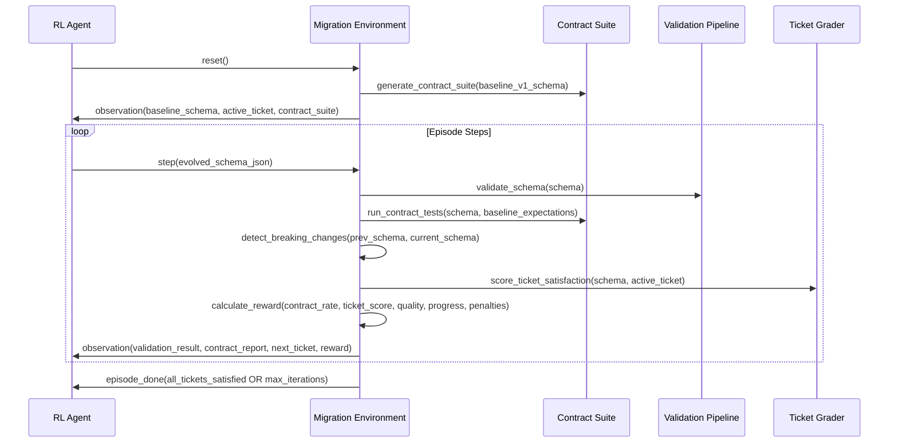

# Design Document: API Lifecycle v1 → v2 Migration Environment

## Overview

The API Lifecycle Migration environment extends the existing API Conformance Gym to train agents on real-world API evolution scenarios. Agents must evolve existing v1 OpenAPI schemas over multiple steps while preserving backward compatibility for existing clients, introducing v2 endpoints only when breaking changes are necessary. This environment addresses the critical platform engineering challenge of API versioning, deprecation, and contract stability.

## Main Algorithm/Workflow



## Core Interfaces/Types

```python
# Migration-specific data models extending existing APIAction/APIObservation
class MigrationAction(APIAction):
    schema_json: str  # Complete evolved OpenAPI schema
    migration_notes: Optional[str] = None  # Agent's migration strategy notes
    
class ContractExpectation(BaseModel):
    path: str  # e.g., "/v1/orders"
    method: str  # e.g., "get"
    required_security: bool = True
    required_response_fields: List[str] = []  # e.g., ["id", "status", "total"]
    status_code: str = "200"

class ContractSuite(BaseModel):
    required_operations: List[Tuple[str, str]]  # (path, method) pairs
    required_security: Dict[str, bool]  # operation_id -> requires_security
    required_response_fields: List[ContractExpectation]
    baseline_schema_hash: str  # For validation

class ContractTestResult(BaseModel):
    contract_pass_rate: float  # 0.0 to 1.0
    contract_failures: List[str]  # Human-readable failure descriptions
    missing_operations: List[Tuple[str, str]]
    response_field_regressions: List[str]
    auth_regressions: List[str]

class BreakingChange(BaseModel):
    change_type: str  # "removed_path", "removed_operation", "removed_field", etc.
    path: str  # JSON path to the change
    description: str  # Human-readable description
    severity: str  # "critical", "major", "minor"

class BreakingChangeReport(BaseModel):
    breaking_change_count: int
    breaking_changes: List[BreakingChange]
    breaking_penalty: float  # Calculated penalty

class MigrationTicket(BaseModel):
    ticket_id: str
    ticket_type: str  # "additive", "deprecation", "security", "compliance"
    title: str
    description: str
    acceptance_criteria: List[str]
    difficulty: str  # "easy", "medium", "hard"

class MigrationObservation(APIObservation):
    baseline_schema_json: str  # Original v1 schema to maintain compatibility with
    active_ticket: Optional[MigrationTicket]
    contract_test_report: ContractTestResult
    breaking_change_report: BreakingChangeReport
    ticket_satisfaction_score: float  # 0.0 to 1.0
    tickets_completed: int
    total_tickets: int
```

## Key Functions with Formal Specifications

### Function 1: generate_contract_suite()

```python
def generate_contract_suite(baseline_schema: Dict[str, Any]) -> ContractSuite
```

**Preconditions:**
- `baseline_schema` is a valid OpenAPI 3.0/3.1 schema dictionary
- Schema contains at least one path with one operation
- Schema has been validated by existing ValidationPipeline

**Postconditions:**
- Returns ContractSuite with 3-8 required operations
- All required operations exist in baseline schema
- Required response fields are extracted from baseline schema responses
- Contract suite is deterministic for same baseline schema

**Loop Invariants:** N/A (no loops in this function)

### Function 2: run_contract_tests()

```python
def run_contract_tests(current_schema: Dict[str, Any], contract_suite: ContractSuite) -> ContractTestResult
```

**Preconditions:**
- `current_schema` is a valid OpenAPI schema dictionary
- `contract_suite` is well-formed with valid operations and expectations
- Contract suite was generated from a compatible baseline schema

**Postconditions:**
- Returns ContractTestResult with pass_rate in [0.0, 1.0]
- contract_pass_rate = 1.0 if and only if all contract expectations are met
- All contract failures are documented with actionable descriptions
- No false positives in failure detection

**Loop Invariants:**
- For operation validation loops: All previously checked operations maintain their pass/fail status
- For field validation loops: Field presence checks remain consistent throughout iteration

### Function 3: detect_breaking_changes()

```python
def detect_breaking_changes(prev_schema: Dict[str, Any], current_schema: Dict[str, Any]) -> BreakingChangeReport
```

**Preconditions:**
- Both schemas are valid OpenAPI dictionaries
- Schemas represent consecutive versions in the evolution sequence
- Both schemas have been successfully parsed

**Postconditions:**
- Returns complete report of all breaking changes between schemas
- Breaking change count accurately reflects number of detected changes
- Each breaking change includes precise path and description
- Breaking penalty is calculated according to severity and count

**Loop Invariants:**
- For path comparison loops: Previously processed paths maintain their change status
- For operation comparison loops: Change detection remains consistent across iterations

## Algorithmic Pseudocode

### Main Environment Reset Algorithm

```pascal
ALGORITHM reset_migration_environment()
OUTPUT: MigrationObservation

BEGIN
  // Step 1: Select baseline v1 schema
  baseline_schema ← select_baseline_v1_schema()
  ASSERT is_valid_openapi_schema(baseline_schema)
  
  // Step 2: Generate contract suite from baseline
  contract_suite ← generate_contract_suite(baseline_schema)
  ASSERT contract_suite.required_operations.length >= 3
  ASSERT contract_suite.required_operations.length <= 8
  
  // Step 3: Initialize ticket queue
  ticket_queue ← generate_ticket_queue()
  active_ticket ← ticket_queue.pop_first()
  
  // Step 4: Initialize environment state
  state ← MigrationState(
    baseline_schema: baseline_schema,
    current_schema: baseline_schema,
    contract_suite: contract_suite,
    ticket_queue: ticket_queue,
    active_ticket: active_ticket,
    iteration_count: 0,
    tickets_completed: 0
  )
  
  // Step 5: Create initial observation
  observation ← MigrationObservation(
    baseline_schema_json: json_stringify(baseline_schema),
    active_ticket: active_ticket,
    contract_test_report: create_initial_contract_report(),
    task_name: "API Lifecycle Migration"
  )
  
  RETURN observation
END
```

**Preconditions:**
- Environment is properly initialized with baseline schema pool
- Ticket generation system is available and functional
- Contract suite generator is operational

**Postconditions:**
- Returns valid MigrationObservation with all required fields
- Baseline schema is valid and contains meaningful API operations
- Contract suite accurately reflects baseline schema expectations
- Active ticket is well-formed with clear acceptance criteria

### Main Environment Step Algorithm

```pascal
ALGORITHM step_migration_environment(action: MigrationAction)
INPUT: action containing evolved schema JSON
OUTPUT: MigrationObservation with reward and done status

BEGIN
  ASSERT action.schema_json IS NOT NULL
  
  // Step 1: Validate evolved schema
  validation_result ← validation_pipeline.validate(action.schema_json)
  
  // Step 2: Parse schema for further processing
  current_schema ← parse_json(action.schema_json)
  IF current_schema IS NULL THEN
    RETURN create_error_observation("Invalid JSON schema")
  END IF
  
  // Step 3: Run contract tests against baseline expectations
  contract_result ← run_contract_tests(current_schema, state.contract_suite)
  
  // Step 4: Detect breaking changes from previous schema
  breaking_report ← detect_breaking_changes(state.current_schema, current_schema)
  
  // Step 5: Score ticket satisfaction
  ticket_score ← score_ticket_satisfaction(current_schema, state.active_ticket)
  
  // Step 6: Calculate progress delta
  previous_combined_score ← (state.previous_contract_rate + state.previous_ticket_score) / 2
  current_combined_score ← (contract_result.contract_pass_rate + ticket_score) / 2
  progress_delta ← MAX(0.0, current_combined_score - previous_combined_score)
  
  // Step 7: Calculate behavior penalties
  penalty ← calculate_behavior_penalties(action, state)
  
  // Step 8: Calculate shaped reward
  quality_score ← 0.55 * validation_result.validity_score + 0.45 * validation_result.best_practices_score
  reward ← 0.45 * contract_result.contract_pass_rate + 
           0.25 * ticket_score + 
           0.20 * quality_score + 
           0.10 * progress_delta - 
           breaking_report.breaking_penalty - 
           penalty
  reward ← CLAMP(reward, 0.0, 1.0)
  
  // Step 9: Update state
  state.current_schema ← current_schema
  state.iteration_count ← state.iteration_count + 1
  state.previous_contract_rate ← contract_result.contract_pass_rate
  state.previous_ticket_score ← ticket_score
  
  // Step 10: Check ticket completion and advance if satisfied
  IF ticket_score >= 0.8 THEN
    state.tickets_completed ← state.tickets_completed + 1
    IF state.ticket_queue IS NOT EMPTY THEN
      state.active_ticket ← state.ticket_queue.pop_first()
    ELSE
      state.active_ticket ← NULL
    END IF
  END IF
  
  // Step 11: Check termination conditions
  all_tickets_done ← (state.active_ticket IS NULL) AND (contract_result.contract_pass_rate >= 0.95)
  max_iterations_reached ← state.iteration_count >= MAX_ITERATIONS
  episode_done ← all_tickets_done OR max_iterations_reached
  
  // Step 12: Create observation
  observation ← MigrationObservation(
    baseline_schema_json: json_stringify(state.baseline_schema),
    active_ticket: state.active_ticket,
    contract_test_report: contract_result,
    breaking_change_report: breaking_report,
    ticket_satisfaction_score: ticket_score,
    validation_errors: validation_result.errors,
    validity_score: validation_result.validity_score,
    best_practices_score: validation_result.best_practices_score,
    reward: reward,
    done: episode_done,
    tickets_completed: state.tickets_completed,
    total_tickets: state.total_tickets
  )
  
  RETURN observation
END
```

**Preconditions:**
- Environment state is properly initialized from reset()
- Action contains valid schema JSON string
- All grading and validation systems are operational

**Postconditions:**
- Returns complete MigrationObservation with all scoring metrics
- Reward is in range [0.0, 1.0] and reflects all scoring components
- Episode termination is correctly determined based on completion criteria
- State is updated consistently for next iteration

### Contract Suite Generation Algorithm

```pascal
ALGORITHM generate_contract_suite(baseline_schema: Dict)
INPUT: baseline_schema - valid OpenAPI schema
OUTPUT: ContractSuite with required operations and expectations

BEGIN
  required_operations ← []
  required_response_fields ← []
  
  // Extract all operations from baseline schema
  paths ← baseline_schema.get("paths", {})
  
  FOR each path_name, path_item IN paths DO
    FOR each method IN ["get", "post", "put", "patch", "delete"] DO
      IF method IN path_item THEN
        operation ← path_item[method]
        
        // Add to required operations (limit to 3-8 most important)
        IF length(required_operations) < 8 THEN
          required_operations.append((path_name, method))
          
          // Extract required response fields for GET operations
          IF method = "get" AND "responses" IN operation THEN
            responses ← operation["responses"]
            IF "200" IN responses THEN
              response_200 ← responses["200"]
              fields ← extract_response_fields(response_200)
              IF fields IS NOT EMPTY THEN
                expectation ← ContractExpectation(
                  path: path_name,
                  method: method,
                  required_response_fields: fields,
                  status_code: "200"
                )
                required_response_fields.append(expectation)
              END IF
            END IF
          END IF
        END IF
      END IF
    END FOR
  END FOR
  
  // Ensure minimum coverage
  IF length(required_operations) < 3 THEN
    THROW Error("Baseline schema has insufficient operations for contract generation")
  END IF
  
  // Generate security requirements
  required_security ← {}
  FOR each (path, method) IN required_operations DO
    required_security[path + "." + method] ← true
  END FOR
  
  contract_suite ← ContractSuite(
    required_operations: required_operations,
    required_security: required_security,
    required_response_fields: required_response_fields,
    baseline_schema_hash: compute_hash(baseline_schema)
  )
  
  RETURN contract_suite
END
```

**Preconditions:**
- baseline_schema is a valid OpenAPI schema dictionary
- Schema contains at least 3 operations across all paths
- Schema has been validated by ValidationPipeline

**Postconditions:**
- Returns ContractSuite with 3-8 required operations
- All required operations exist in the baseline schema
- Response field expectations are extracted from actual schema responses
- Contract suite is deterministic for the same input schema

**Loop Invariants:**
- All operations added to required_operations exist in baseline schema
- required_operations length never exceeds 8
- Each response field expectation corresponds to an actual operation

## Example Usage

```python
# Example 1: Environment initialization and reset
env = MigrationEnvironment()
observation = env.reset(seed=42)

print(f"Baseline schema: {observation.baseline_schema_json[:100]}...")
print(f"Active ticket: {observation.active_ticket.title}")
print(f"Contract requirements: {len(observation.contract_test_report.required_operations)} operations")

# Example 2: Agent evolution step
evolved_schema = {
    "openapi": "3.0.0",
    "info": {"title": "Library API", "version": "1.1.0"},
    "paths": {
        "/v1/books": {
            "get": {"summary": "List books", "security": [{"apiKey": []}]},
            "post": {"summary": "Create book", "security": [{"apiKey": []}]}
        },
        "/v1/books/{id}": {
            "get": {"summary": "Get book", "security": [{"apiKey": []}]}
        },
        # New additive endpoint for ticket satisfaction
        "/v1/books/{id}/reviews": {
            "get": {"summary": "Get book reviews", "security": [{"apiKey": []}]},
            "post": {"summary": "Add review", "security": [{"apiKey": []}]}
        }
    },
    "components": {
        "securitySchemes": {
            "apiKey": {"type": "apiKey", "in": "header", "name": "X-API-Key"}
        }
    }
}

action = MigrationAction(schema_json=json.dumps(evolved_schema))
observation = env.step(action)

print(f"Contract pass rate: {observation.contract_test_report.contract_pass_rate}")
print(f"Ticket satisfaction: {observation.ticket_satisfaction_score}")
print(f"Breaking changes: {observation.breaking_change_report.breaking_change_count}")
print(f"Reward: {observation.reward}")

# Example 3: Complete episode workflow
while not observation.done:
    # Agent evolves schema based on feedback
    evolved_schema = agent.evolve_schema(
        baseline=observation.baseline_schema_json,
        ticket=observation.active_ticket,
        contract_failures=observation.contract_test_report.contract_failures,
        validation_errors=observation.validation_errors
    )
    
    action = MigrationAction(schema_json=evolved_schema)
    observation = env.step(action)
    
    if observation.ticket_satisfaction_score >= 0.8:
        print(f"Ticket completed: {observation.active_ticket.title}")

print(f"Episode completed. Total tickets: {observation.tickets_completed}/{observation.total_tickets}")
```

## Correctness Properties

*A property is a characteristic or behavior that should hold true across all valid executions of a system-essentially, a formal statement about what the system should do. Properties serve as the bridge between human-readable specifications and machine-verifiable correctness guarantees.*

### Property 1: Contract Suite Generation Bounds

*For any* valid baseline OpenAPI schema, the generated contract suite should contain between 3 and 8 required operations.

**Validates: Requirements 1.1**

### Property 2: Contract Preservation Completeness

*For any* schema evolution and contract suite, the contract pass rate equals 1.0 if and only if all required operations, response fields, and security requirements are satisfied.

**Validates: Requirements 1.2, 1.4, 1.5**

### Property 3: Contract Pass Rate Range

*For any* contract test execution, the returned pass rate should be within the range [0.0, 1.0].

**Validates: Requirements 1.3**

### Property 4: Breaking Change Detection Accuracy

*For any* pair of consecutive schema versions, when an operation is removed, the breaking change detector should identify it with the correct change type and path location.

**Validates: Requirements 2.1, 2.5**

### Property 5: Breaking Change Classification Consistency

*For any* detected breaking change, it should be classified with appropriate type and severity level based on the nature of the change.

**Validates: Requirements 2.2, 2.4**

### Property 6: Breaking Change Penalty Application

*For any* schema evolution with breaking changes, appropriate penalties should be applied to the reward calculation based on change severity and count.

**Validates: Requirements 2.3**

### Property 7: Ticket Progression Threshold

*For any* ticket satisfaction scenario, progression to the next ticket should occur if and only if the satisfaction score is greater than or equal to 0.8.

**Validates: Requirements 3.2**

### Property 8: Episode Termination Conditions

*For any* environment state, episode termination should occur if and only if all tickets are completed with contract pass rate >= 0.95, or maximum iterations are reached.

**Validates: Requirements 3.5, 6.5**

### Property 9: Reward Component Weighting

*For any* reward calculation, the components should be weighted as follows: contract preservation 45%, ticket satisfaction 25%, schema quality 20%, progress improvement 10%.

**Validates: Requirements 4.1, 4.2, 4.3, 4.4**

### Property 10: Reward Range Clamping

*For any* calculated reward value, the final reward should be clamped to the range [0.0, 1.0] regardless of intermediate calculations.

**Validates: Requirements 4.6**

### Property 11: Penalty Subtraction Consistency

*For any* scenario with breaking changes or behavior penalties, the penalties should be consistently subtracted from the base reward calculation.

**Validates: Requirements 4.5**

### Property 12: Baseline Schema Preservation

*For any* episode execution, the baseline schema should remain unchanged throughout all environment steps.

**Validates: Requirements 6.4**

### Property 13: State Transition Consistency

*For any* environment step, iteration counts and completion tracking should be maintained accurately across state transitions.

**Validates: Requirements 6.2**

### Property 14: Observation Completeness

*For any* generated observation, it should include all required components: baseline schema, active ticket, contract test results, breaking change reports, and validation information.

**Validates: Requirements 7.1, 7.2, 7.3, 7.4, 7.5**

### Property 15: Error Handling Robustness

*For any* invalid JSON schema input, the environment should return descriptive error observations without crashing or losing stability.

**Validates: Requirements 10.1, 10.5**

### Property 16: Initialization Error Handling

*For any* baseline schema with insufficient operations (< 3), the environment should raise appropriate initialization errors during contract suite generation.

**Validates: Requirements 10.2**